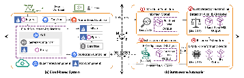

# Burst-aware Autoscaler

Source code of paper `Multi-Level ML Based Burst-Aware Autoscaling for SLO Assurance and Cost Efficiency` submit to TSC. 

The overview of the proposal shown as a MAPE loop: (a) Cloud-based system that provides Monitoring and Execution; (b) Burst-aware autoscaler for Analysis and Planning includes *Workloads Prediction, Burst Detection \& Handling, Resource Estimation*, and *Estimation Enhancement*.



## Require

```
python  3.6.0
torch  1.8.2
gym  0.22
pandas  1.4
numpy  1.22
sklearn  1.2
```

## Running

### Load generate using k8

```bash
cd k6
bash background.sh 
```

### Autoscale

```bash
python -u main.py
```
